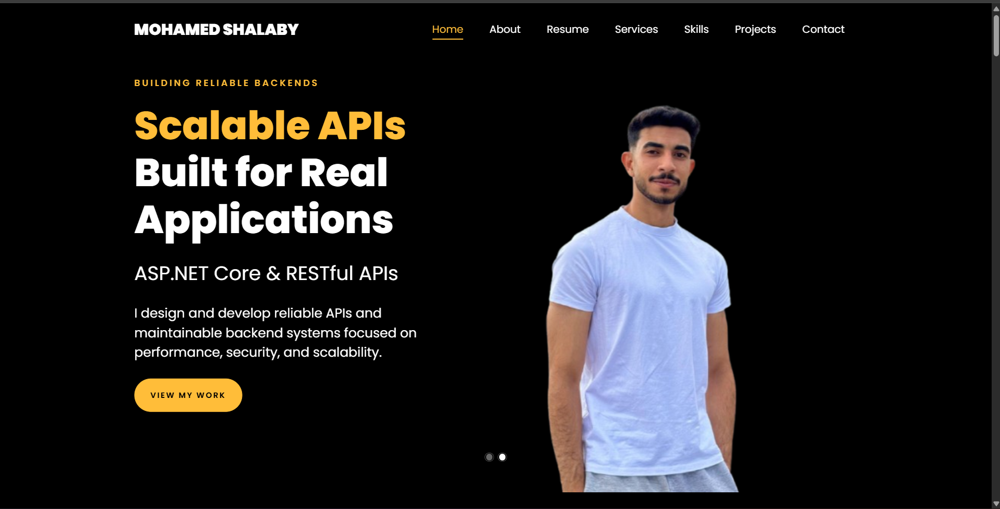

# Mohamed Shalaby — .NET Backend Developer Portfolio

<p align="center">
  
  
  
  
  
</p>

<p align="center">
  A modern personal portfolio website showcasing my journey, skills, services, and backend development projects.
</p>

<p align="center">
  <a href="YOUR_VERCEL_LINK">
    
  </a>
  <a href="https://linkedin.com/in/moredash">
    
  </a>
</p>

---

## 👨‍💻 About

I'm **Mohamed Reda Shalaby**, a Computer Science student and Junior .NET Backend Developer focused on building reliable, secure, and maintainable backend solutions.

My main focus is **C#, ASP.NET Core, Web APIs, Entity Framework Core, SQL Server, and Clean Architecture**.

This portfolio was built to showcase my technical skills, development projects, services, and professional journey.

---

## 🚀 Live Demo

🌐 **Portfolio:**
[Visit My Portfolio](https://mohamed-shalaby-portfolio.vercel.app)

---

## ✨ Features

* 🎯 Modern one-page portfolio
* 📱 Responsive design for desktop, tablet, and mobile
* 👨‍💻 Backend-focused professional profile
* 🛠️ Services showcase
* 💼 Education & training experience
* 🚀 Featured projects
* 📄 CV download
* 🔗 GitHub & LinkedIn integration
* 📩 Contact section
* ✉️ Email integration through `mailto`
* 🎨 Smooth navigation and interactive UI

---

## 🧰 Tech Stack

### Frontend

* HTML5
* CSS3
* JavaScript
* Bootstrap

### Development

* Visual Studio Code
* Git
* GitHub

### Deployment

* Vercel

---

## 📂 Featured Projects

### 🛒 Multi-Vendor Marketplace

A multi-vendor e-commerce platform built with a focus on maintainable backend architecture and real-world business workflows.

**Technologies:**

* ASP.NET Core MVC
* C#
* Entity Framework Core
* SQL Server
* Clean Architecture
* ASP.NET Core Identity
* Repository Pattern
* Unit of Work
* Stripe Integration

🔗 [View Repository](https://github.com/shalaby1222/Multi-Vendor-Marketplace)

---

### 🏥 VitaCare Clinic Management System

A clinic management backend designed to handle clinical workflows, medical records, billing, scheduling, and real-time notifications.

**Technologies:**

* ASP.NET Core Web API
* .NET
* Entity Framework Core
* SQL Server
* SignalR
* JWT Authentication
* ASP.NET Core Identity
* Fluent API
* RESTful APIs

🔗 [View Repository](https://github.com/shalaby1222/ClinicManagementSystem-Backend)

---

## 🧩 Portfolio Sections

The portfolio includes:

| Section      | Description                             |
| ------------ | --------------------------------------- |
| 🏠 Home      | Introduction and professional headline  |
| 👤 About     | Background, specialization, and profile |
| 📄 Resume    | Education, training, and experience     |
| 🛠️ Services | Backend development services            |
| 💻 Skills    | Technical skills and technologies       |
| 🚀 Projects  | Selected development projects           |
| 📩 Contact   | Contact information and message form    |

---

## 🎯 What I Offer

* ASP.NET Core Web API Development
* Backend Development
* Database Design
* Authentication & Authorization
* API Integration
* Backend Architecture

---

## 📸 Screenshots

<p align="center">
  
</p>

---

## 📁 Project Structure

```text
mohamed-shalaby-portfolio/
│
├── css/
├── fonts/
├── images/
├── js/
├── scss/
├── files/
│   └── Mohamed-Shalaby-CV.pdf
│
├── index.html
├── single.html
└── README.md
```

---

## ⚙️ Run Locally

Clone the repository:

```bash
git clone https://github.com/shalaby1222/mohamed-shalaby-portfolio.git
```

Open the project folder:

```bash
cd mohamed-shalaby-portfolio
```

Then open `index.html` in your browser.

For the best development experience, use **Live Server** in VS Code.

---

## 📬 Contact

**Mohamed Reda Shalaby**

📍 Gharbia, Egypt

📧 [momoshalaby46@gmail.com](mailto:momoshalaby46@gmail.com)

💼 [LinkedIn](https://linkedin.com/in/moredash)

💻 [GitHub](https://github.com/shalaby1222)

---

## 📄 License

This project is intended to showcase my personal portfolio and development work.

---

<p align="center">
  Built with ❤️ by <strong>Mohamed Reda Shalaby</strong>
</p>
```

